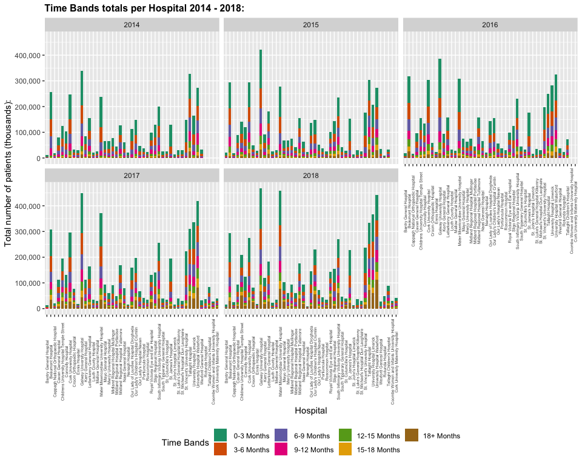

CT5103 Case Studies in Data Analytics - Assignment 3
================
Kevin Derrane
27 March 2019

``` r
# Various libraries used.  
library(ckanr)
library(ggplot2)
library(scales)
library(dplyr)
library(RColorBrewer)
library(treemapify)
library(writexl)
```

1. Accessing the datasets available on Open Data Platform:
----------------------------------------------------------

This first step of this task is accessing the relevant dataset from <https://data.gov.ie/>. Here the CKAN API for R was used. The datasets we are looking for are from the OP Waiting List By Group Hospital from 2014 - 2018.

We first had to connect to the <https://data.gov.ie/> by setting the URL for the ckanr\_setup function. After this we searched for packages based on "op-waiting-list-by-group-hospital". After this a year variable was set to write the correct year to each pulled csv. Finally a for loop was used to loop through these packages and pull the relevant csv file from the URL. Each csv was given the appropriate name and a year column was added displaying which year, i.e. 2017, 2014 etc.

``` r
# ckanr_setup sets CKAN connection details. 
# We will be setting this to the data.gov.ie website. 
ckanr_setup(url = "https://data.gov.ie/")

# Here we are selecting the packages that are related to 
# op-waiting-list-by-group-hospital
govData <- package_show('op-waiting-list-by-group-hospital')

# Assign the year 2020 to variable year.
# Using this we can write the correct year to each csv name
year = 2020 

# Use a for loop to loop through these packages and grab the csv files from the url 
for (i in 1:length(govData$resources)){
  # Here we are giving a name to the pulled csv file
  # we are using the above variable year to write the correct year for 
  # easier identification. 
  govDataName <- paste("csv", year-i, sep = "")
  # Here we are reading in the pulled csv file.
  govDataTemp <- read.csv(govData$resource[[i]]$url, header=TRUE, sep=",")
  # For each dataset, we are going to add in a year column. 
  # This will make it easier to aggregate our data. 
  govDataTemp$Year <- year-i
  # Here we are going to write the csv's to dataframes and name them. 
  assign(govDataName, govDataTemp)
}
```

2. Integrating the datasets into one dataset:
---------------------------------------------

The second step of this task is concatenating the four datasets into one. This will make it easier to aggregate our data in the next step.

Our columns names for the datasets from 2014 - 2016 have the same naming scheme. 2017 has a slightly different naming scheme and 2018 has no column names at all. To concatenate these datasets, the columns have to be renamed and added.

The following changes were made to the 2017 column names:

1.  Age.Profile was renamed to Age.Categorisation
2.  Speciality was renamed to Specialty
3.  Total was renamed to Count

For our 2018 dataset we had no column names so we had to add them. We named these columns based on the previous datasets column names. These column names are as follows: 'Archive.Date', 'Group', 'Hospital.HIPE', 'Hospital', 'Specialty.HIPE', 'Specialty', 'Adult.Child', 'Age.Categorisation', 'Time.Bands', 'Count', 'Year'.

The datasets are first checked to make sure they have no missing values.

``` r
# Check for any missing values. 
sum(is.na(csv2014))
```

    ## [1] 0

``` r
sum(is.na(csv2015))
```

    ## [1] 0

``` r
sum(is.na(csv2016))
```

    ## [1] 0

``` r
sum(is.na(csv2017))
```

    ## [1] 0

``` r
sum(is.na(csv2018))
```

    ## [1] 0

The datasets are then concatenated vertically, i.e. the columns remain the same but the number of rows increase. This makes it easier to aggregate the data.

``` r
# For the 2017 data some of the column names are different and spelt different 
# compared to 2014-2016. To keep in line with each other we will be renaming this CSV
# to the column names of 2014-2016. 
colnames(csv2017)[names(csv2017) == "Age.Profile"] <- "Age.Categorisation"
colnames(csv2017)[names(csv2017) == "Speciality"] <- "Specialty"
colnames(csv2017)[names(csv2017) == "Total"] <- "Count"


# Our 2018 dataset does not have any column values. So we are going to add 
# column names based on the other four datasets. 
colnames(csv2018) <- c('Archive.Date', 'Group', 'Hospital.HIPE', 'Hospital', 'Specialty.HIPE', 
                       'Specialty', 'Adult.Child', 'Age.Categorisation', 'Time.Bands', 'Count', 'Year')

# Join the datasets
# Here we are going to concatenate the datasets vertically. 
# The number of columns will remain the same but the number of rows will increase. 
csvFull <- do.call("rbind", list(csv2014, csv2015, csv2016, csv2017, csv2018))


# View the joined dataset. 
head(csvFull)
```

    ##   Archive.Date                     Group Hospital.HIPE
    ## 1   2014-01-31 Children's Hospital Group           940
    ## 2   2014-01-31 Children's Hospital Group           940
    ## 3   2014-01-31 Children's Hospital Group           940
    ## 4   2014-01-31 Children's Hospital Group           940
    ## 5   2014-01-31 Children's Hospital Group           940
    ## 6   2014-01-31 Children's Hospital Group           940
    ##                                      Hospital Specialty.HIPE  Specialty
    ## 1 Childrens University Hospital Temple Street           NULL      Other
    ## 2 Childrens University Hospital Temple Street           NULL      Other
    ## 3 Childrens University Hospital Temple Street           NULL      Other
    ## 4 Childrens University Hospital Temple Street           NULL      Other
    ## 5 Childrens University Hospital Temple Street           0100 Cardiology
    ## 6 Childrens University Hospital Temple Street           0100 Cardiology
    ##   Adult.Child Age.Categorisation  Time.Bands Count Year
    ## 1       Child               0-15  0-3 Months     4 2014
    ## 2       Child               0-15  3-6 Months     1 2014
    ## 3       Child               0-15  6-9 Months     1 2014
    ## 4       Child              16-64  0-3 Months     1 2014
    ## 5       Child               0-15  0-3 Months   193 2014
    ## 6       Child               0-15  3-6 Months   132 2014

3. Aggregate counts:
--------------------

The third step of this task is aggregating the data and generating a summary table for OP Waiting list showing the changes years wise across several dimensions. The different aggregation tables are then written to one xlsx file with each table representing one sheet.

The dplyr library was used here to generate our aggregations. Our aggregations include the following:

1.  **Year Count**: Total number of patients on the waiting lists for each year 2014-2018.
2.  **Age Category Count**: Total number of patients for each age category for each year 2014-2018.
3.  **Adult & Child Count**: Total number of patients who are adults or children on the waiting list for each year 2014-2018.
4.  **Adult & Child per Hospital Count**: Total number of patients who are adults or children on the waiting list for each Hospital for each year 2014-2018.
5.  **Time Bands Count**: Total number of patients on the waiting lists for each Time Band for each year 2014-2018.
6.  **Time Bands per Hospital Count**:Total number of Time Bands for each Hospital for each year 2014-2018.
7.  **Hospital Count**: Total number of patients on the waiting lists for each Hospital for each year 2014-2018.
8.  **Specialty Time Bands Count**: Total number time bands for each specialty for each year 2014-2018.
9.  **Specialty Count**: Total number of occurrences of each specialty for each year 2014-2018.

``` r
# Below are a number of aggregations showing the changes year wise 
# across several dimensions. 

# A) Year count: This is the total number of patients on the 
# waiting lists for each year 2014-2018. 
yearCount <- csvFull %>% 
  group_by(Year) %>% 
  summarise(Count = sum(Count))


# B) Age category count: This is the total number of patients 
# for each age category for each year 2014-2018.
yearAge <- csvFull %>% 
  group_by(Year, Age.Categorisation) %>% 
  summarise(Count = sum(Count))


# C) Adult & Child count: This is the total number of patients 
# who are adults or childen on the waiting list for each year 2014-2018.
yearAdultChild <- csvFull %>% 
  group_by(Year, Adult.Child) %>% 
  summarise(Count = sum(Count))

# C1) Adult & Child count: This is the total number of patients 
# who are adults or childen on the waiting list for each Hospital 
# for each year 2014-2018.
yearAdultChildHospital <- csvFull %>% 
  group_by(Year, Hospital, Adult.Child) %>% 
  summarise(Count = sum(Count))


# D) Time Bands count: This is the total number of patients on the 
# waiting lists for each Time Band for each year 2014-2018. 
yearTimeBand <- csvFull %>% 
  group_by(Year, Time.Bands) %>% 
  summarise(Count = sum(Count))

# D1) Time Bands per Hospital count: This is the total number of Time Bands 
# for each Hospital for each year 2014-2018. 
yearHospitalTimeBandsCount <- csvFull %>% 
  group_by(Year, Hospital, Time.Bands) %>% 
  summarise(Count = sum(Count)) 


# E&E1) Hospital count: This is the total number of patients on the 
# waiting lists for each Hospital for each year 2014-2018. 
yearHospitalCount <- csvFull %>% 
  group_by(Year, Hospital) %>% 
  summarise(Count = sum(Count)) 


# F) Specialty Time Bands count: This is the total number time bands
# for each specialty for each year 2014-2018. 
yearSpecialtyTimeBandsCount <- csvFull %>% 
  group_by(Year, Specialty, Time.Bands) %>% 
  summarise(Count = sum(Count)) 


# G) Specialty count: This is the number of occurences of 
# each specialty for each year 2014-2018. 
yearSpecialtyCount <- csvFull %>%
  group_by(Year) %>%
  count(Specialty, sort = T) 
```

    ## Warning: `as_dictionary()` is soft-deprecated as of rlang 0.3.0.
    ## Please use `as_data_pronoun()` instead
    ## This warning is displayed once per session.

    ## Warning: `new_overscope()` is soft-deprecated as of rlang 0.2.0.
    ## Please use `new_data_mask()` instead
    ## This warning is displayed once per session.

    ## Warning: The `parent` argument of `new_data_mask()` is deprecated.
    ## The parent of the data mask is determined from either:
    ## 
    ##   * The `env` argument of `eval_tidy()`
    ##   * Quosure environments when applicable
    ## This warning is displayed once per session.

    ## Warning: `overscope_clean()` is soft-deprecated as of rlang 0.2.0.
    ## This warning is displayed once per session.

Here the tables above are written to one open data format file 'OP Waiting list.xlsx'. This file is an xlsx file where each table represents a sheet. The writexl library was used.

``` r
# Write all the tables above to one xlsx file with multiple sheets for each table
# The writexl library is used. 
sheets <- list("Patients Count" = yearCount, "Age Categories" = yearAge,
               "Adult & Children" = yearAdultChild, "Adult & Children per Hospital" = yearAdultChildHospital,
               "Time Bands" = yearTimeBand, "Time Bands per Hospital" = yearHospitalTimeBandsCount,
               "Hospitals" = yearHospitalCount, "Specialty Time Bands" = yearSpecialtyTimeBandsCount,
               "Specialty Count" = yearSpecialtyCount) 

write_xlsx(sheets, "OP Waiting list.xlsx")
```

4. Visualisation of the results and visualisation results:
----------------------------------------------------------

The final step of this task is visualising the data generated in our previous step. The GGplot and Treemapify libraries were used to create our visualisations.

##### Plot 1:

Our below visualisation is a comparison of the number of patients on the waiting list for each year 2014 - 2018. As we can see it has grown steadily by almost 2 million since 2014.

``` r
# A) Year count:
pA <- ggplot(yearCount, aes(x = Year, y = Count, fill = as.factor(Year)))
pA + ggtitle("OP Waiting list totals 2014 - 2018:") +
  # Geom_bar is for bar chart. 
  geom_bar(stat="identity", width=0.7) +
  # Edit the y axis to display in millions instead of 10e 
  scale_y_continuous(name="Total number of patients (millions):", 
                     labels = scales::comma) +
  # Set the title to be bold. 
  theme(plot.title = element_text(size = 12, face = "bold")) +
  labs(fill='Year') +
  # Select the color palette Dark2
  scale_fill_brewer(palette="Dark2")
```


##### Plot 2:

Our below visualisation is a comparison of the number of Age Categories on the waiting list for each year 2014 - 2018. We can see our spread is about even across the years as the waiting list has increased.

``` r
# B) Age category count 2014-2018: 
pB <- ggplot(yearAge, aes(Year, Count, fill = Age.Categorisation))
pB + ggtitle("Age category totals 2014 - 2018:") +
  geom_bar(stat="identity", width=0.7) +
  scale_y_continuous(name="Total number of patients (millions):", 
                     labels = scales::comma) +
  theme(plot.title = element_text(size = 12, face = "bold"),
        legend.position = "bottom", legend.box = "horizontal") +
  labs(fill='Age Category') +
  scale_fill_brewer(palette="Dark2")
```


##### Plot 3:

Our below visualisation is a comparison of the number of Adults & Children on the waiting list for each year 2014 - 2018. Again, we can see our spread is about even across the years as the waiting list has increased.

``` r
# C) Adult & Child count 2014-2018: 
pC <- ggplot(yearAdultChild, aes(Year, Count, fill = Adult.Child))
pC + ggtitle("Adult & Child totals 2014 - 2018:") +
  geom_bar(stat="identity", width=0.7) +
  scale_y_continuous(name="Total number of patients (millions):", 
                     labels = scales::comma) +
  # Set the legend position. 
  theme(plot.title = element_text(size = 12, face = "bold"),
        legend.position = "bottom", legend.box = "horizontal") +
  labs(fill='Category:') +
  scale_fill_brewer(palette="Dark2")
```


##### Plot 4:

Our below visualisation is a comparison of the number of Age & Children on the waiting list per Hospital for each year 2014 - 2018. We can the changes throughout the year for each Hospital. We can also see some new hospitals added as the years went on. Again, our spread seems to correlate to the increase in the number of patients.

``` r
# C1) Adult & Child for each Hospital count 2014-2018: 
pC1 <- ggplot(yearAdultChildHospital, aes(Hospital, Count, fill = Adult.Child))
pC1 + ggtitle("Adult & Child totals per Hospital 2014 - 2018:") +
  geom_bar(stat="identity", width=0.7) +
  # Facet wrap based on year. 
  facet_wrap(~Year) +
  scale_y_continuous(name="Total number of patients (thousands):", 
                     labels = scales::comma) +
  theme(plot.title = element_text(size = 12, face = "bold"),
        legend.position = "bottom", legend.box = "horizontal", 
        axis.text.x = element_text(size = 6, angle=90, vjust=0.6)) +
  labs(fill='Time Bands') +
  scale_fill_brewer(palette="Dark2")
```


##### Plot 5:

Our below visualisation is a comparison of the length of time (Time.Bands) patients are on the waiting list for each year 2014 - 2018. From this visualisation we can see that there is not a direct correlation between the increase in patients and the increase across the different time bands. Patients seem to be waiting longer on average. In 2014 we had almost no 18+ month patients but in 2018 it was responsible for about 1/5th of the waiting list time. The 0-3 months time band does not seem to have changed at all in size despite the increase in the total number of patients.

``` r
# D) Time Bands count 2014-2018: 
pD <- ggplot(yearTimeBand, aes(Year, Count, fill = Time.Bands))
pD + ggtitle("Time Bands totals 2014 - 2018:") +
  geom_bar(stat="identity", width=0.7) +
  scale_y_continuous(name="Total number of patients (millions):", 
                     labels = scales::comma) +
  theme(plot.title = element_text(size = 12, face = "bold"),
        legend.position = "bottom", legend.box = "horizontal") +
  labs(fill='Time Bands') +
  scale_fill_brewer(palette="Dark2")
```


##### Plot 6:

Our below visualisation is a comparison of the length of time (Time.Bands) patients are on the waiting list per Hospital for each year 2014 - 2018. This graph correlates with our above results. Waiting times for Hospitals are increasing with 18+ months having the biggest increase.

``` r
# D1) Time Bands count for each hospital 2014-2018: 
pD1 <- ggplot(yearHospitalTimeBandsCount, aes(Hospital, Count, fill = Time.Bands))
pD1 + ggtitle("Time Bands totals per Hospital 2014 - 2018:") +
  geom_bar(stat="identity", width=0.7) +
  facet_wrap(~Year) +
  scale_y_continuous(name="Total number of patients (thousands):", 
                     labels = scales::comma) +
  theme(plot.title = element_text(size = 12, face = "bold"),
        legend.position = "bottom", legend.box = "horizontal", 
        axis.text.x = element_text(size = 5, angle=90, vjust=0.6)) +
  labs(fill='Time Bands') +
  scale_fill_brewer(palette="Dark2")
```



##### Plot 7:

Our below visualisation is a comparison of the number patients are on the waiting list for each Hospital for each year 2014 - 2018. Generally, we can see that our line graphs are increasing across the board. Some have went down but they mainly have increased. Some Hospital are worse offenders compared to others.

``` r
# E) Hospital count for each hospital 2014-2018: 
pE <- ggplot(yearHospitalCount, aes(Year, Count, fill = Hospital))
pE + ggtitle("Waiting list total for each Hospital 2014 - 2018:") +
  # Geom_line is for line chart. 
  geom_line(data=yearHospitalCount, size =1, show.legend = TRUE, 
               (aes(x =Year, y=Count, colour= Hospital, group = Hospital))) +
  facet_wrap(~Hospital) +
  scale_y_continuous(name="Total number of patients (thousands):", 
                     labels = scales::comma) +
  theme(plot.title = element_text(size = 12, face = "bold"),
        strip.text = element_text(size = 5), axis.text.x = 
          element_text(size=8, angle =60, hjust=1, vjust = .5), 
        legend.position = "none") 
```


##### Plot 8:

Our below visualisation is again a comparison of the number patients are on the waiting list for each Hospital for each year 2014 - 2018. With Bantry General Hospital, Galway University Hospital and Our Lady's Children's Hospital Crumlin highlighted. This graph is another form of our previous graph. It again shows us an increase for most hospitals. Galway University Hospital was our worst offender. It it is about 1.5 times more compared to 2014.Our Lady's Children's Hospital Crumlin was slowly increasing from 2014 - 2016 but from 2016 - 2017, its increase accelerated. Bantry General Hospital actually went down, but it's patients numbers to begin with were low.

``` r
# E1) Hospital count comparing hospitals 2014-2018: 
# Below, three hospitals have been selected to plot against the rest. 
# The black line here is the mean. 
selectedHospitals<- subset(yearHospitalCount, Hospital=="Bantry General Hospital" | 
                                Hospital =="Galway University Hospital" | 
                                Hospital =="Our Lady's Children's Hospital Crumlin")

pE1 <- ggplot(yearHospitalCount, aes(Year, Count, group = Hospital))
pE1 + ggtitle("Waiting lists for Hospitals 2014-2018:") +
  geom_line( size= 0.25, na.rm = TRUE, color="grey90", alpha =0.6, 
             show.legend = FALSE ) +
  geom_line(data=selectedHospitals, size =1, show.legend = TRUE, 
            (aes(x =Year, y=Count, colour= Hospital, group = Hospital))) +
  stat_summary(fun.y=mean,geom="line",lwd=1,aes(group=1)) +
  scale_y_continuous(name="Total number of patients (thousands):", 
                     labels = scales::comma) +
  # this theme clears away grid lines, makes backgound white  
  theme(plot.title = element_text(size = 12, face = "bold"),
        panel.grid.major = element_blank(), panel.background = element_blank(), 
        axis.line = element_line(colour = "black", size = 0.25), axis.title.x=element_blank(), 
        axis.text.x = element_text(angle = 30, hjust=1, vjust = .5), 
        legend.key = element_rect(fill = NA, colour = NA, size = 0.25)) +
  scale_colour_brewer(palette = "Set1") 
```


##### Plot 9:

Our below visualisation is again a comparison of the waiting times (Time Bands) on the waiting list for each Specialty for each year 2014 - 2018. We can see a general increase across the board for each Specialty. Some Specialties that were there in 2014 are no longer there in 2018 and some in 2018 weren't there in 2014.The increase in Time Bands again correlates to our previous results on the Time Bands above.

``` r
# F) Time Band count for each Specialty 2014-2018: 
pF <- ggplot(yearSpecialtyTimeBandsCount, aes(Specialty, Count, fill = Time.Bands))
pF + ggtitle("Time Bands totals per Specialty 2014 - 2018:") +
  geom_bar(stat="identity", width=0.7) +
  facet_wrap(~Year) +
  scale_y_continuous(name="Total number of patients (thousands):", 
                     labels = scales::comma) +
  theme(plot.title = element_text(size = 12, face = "bold"),
        legend.position = "bottom", legend.box = "horizontal", 
        axis.text.x = element_text(size = 5, angle=90, vjust=0.6)) +
  labs(fill='Time Bands') +
  scale_fill_brewer(palette="Dark2")
```


##### Plot 10:

Our below visualisation is a comparison of the Specialties on the waiting list for each year 2014 - 2018. This time we are looking at a treemap for each Specialty. Similar to above we can see an increase in some Specialties and that some Specialties that were there in 2014 are no longer there in 2018 and some in 2018 that weren't there in 2014. For Example in 2014 our top Specialty was Otolaryngology and in 2018 it was Orthopedics. For 2014 too, we can see bigger clusters compared to 2018. This shows us an increase in the number of Specialties as well as an increase in the waiting lists for each.

``` r
# g) Treemap for each Specialty 2014-2018: 
pG <- ggplot(yearSpecialtyCount, aes(area = n, fill = n)) +
  geom_treemap() +
  geom_treemap_text(aes(label = Specialty) , color = "black", 
                    place = "centre", grow = T,
                    min.size = 2) +
  facet_wrap( ~ Year) +
  scale_fill_gradientn(colours = terrain.colors(10)) +
  theme(plot.title = element_text(size = 12, face = "bold"),
        legend.position = "bottom", legend.box = "horizontal")+
  labs(
    title = "Specialty occurrences 2014-2018: ",
    fill = "Frequency (thousands):" 
  )

# Print the tree
pG
```


Conclusion:
-----------

Our graph results have already been discussed above. As we can see from our graphs above and their results, there are a number of changes in the 'OP Waiting List By Group Hospital' datasets from 2014 to 2018. The main changes across these dimensions include the following:

1.  **Count:** The total number of patients on the waiting list has increased steadily from 2014 to 2018. It went from 4,236,176 in 2014 to 6,127,744 in 2018. This is an increase of almost 2 million. It increased at an average of almost 500,000 a year. This shows us that the number of people on the waiting list is increasing as the years go on.

2.  **Age.Categorisation:** The Age Categories followed the trend set by the increase in the total number of patients on the waiting list. Each category increased evenly across the board.

3.  **Time.Bands:** The Time Bands did not follow the trend set by the increase in the total number of patients on the waiting list. Some Time Bands increased more compared to others. for example in 2014, the Time Band 18+ months was 97,282, by 2018 this increased to 977,822 an increase of almost 900,000. This is not correlated to the increase in the number of patients. This tells us that the waiting times are increasing as the years go on.

4.  **Adult.Child:** The number of Adults & Children followed the trend set by the increase in the total number of patients on the waiting list. Each category increased evenly across the board.

5.  **Hospital:** The waiting times for patients per Hospital generally increased across the board. Some Hospital had higher increases compared to others. A couple of Hospital actually had a decrease in waiting times but this was a minority. Our higher end Time Bands are also increasing for each Hospital. This correlates to our above results for Time Bands. This tells us that the waiting times are increasing as the years go on for each Hospital and the waiting times are getting longer.

6.  **Specialty:** The total number of patients on the waiting list for each Specialty increased across the board. However, some Specialties that were there in 2014 are no longer there in 2018 and some in that were there in 2018 weren't there in 2014. For each year there were different Specialties that had the highest waiting times. This shows us that the demands for Specialties are changing as the years go on and the waiting times for Specialties are also changing.

References:
===========

Below are references to websites we used to help us complete this assignment.

**Websites:**

-   <https://data.gov.ie/>

-   <https://cran.r-project.org/web/packages/dplyr/dplyr.pdf>

-   <https://stackoverflow.com/questions/27713310/r-easy-way-to-export-multiple-data-frame-to-multiple-excel-worksheets>

-   <https://cran.r-project.org/web/packages/treemapify/vignettes/introduction-to-treemapify.html>

-   <https://github.com/ropensci/ckanr>

-   <http://r-statistics.co/Top50-Ggplot2-Visualizations-MasterList-R-Code.html>
